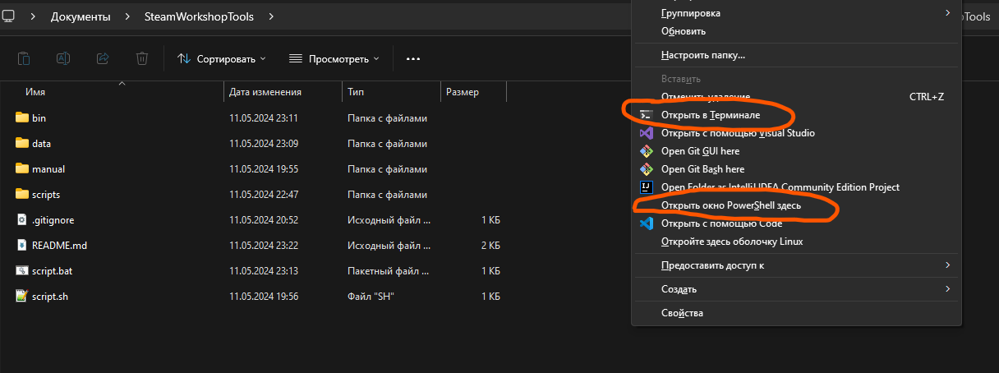

# SteamWorkshopTools

> Устарело, но работает:
В ручную - [here/тык](https://github.com/Sepera-okeq/SteamWorkshopTools/tree/main/manual)

Этот скрипт основан на использовании SteamCMD. Подробнее [here](https://developer.valvesoftware.com/wiki/SteamCMD)

Русская версия доступна здесь: [тык](https://github.com/Sepera-okeq/SteamWorkshopTools/blob/main/README-RU.md)

Выберите свою собственную ОС:

- [SteamWorkshopTools](#steamworkshoptools)
  - [Windows](#windows)
  - [Linux](#linux)
  - [MasOS](#masos)
  - [SteamID](#steamid)
    - [Как найти мне AppID?](#как-найти-мне-appid)
    - [Как найти мне ID модификации?](#как-найти-мне-id-модификации)

## Windows

0. Установите Powershell 7, следуя инструкциям [MSDN](https://learn.microsoft.com/ru-ru/powershell/scripting/install/installing-powershell-on-windows?view=powershell-7.4)
Рекомендуется: [MS Store](https://apps.microsoft.com/detail/9mz1snwt0n5d?rtc=1&hl=nl-nl&gl=NL)

1. Склонируйте проект:

```bash
git clone https://github.com/Sepera-okeq/SteamWorkshopTools.git
```

2. Перейдите в папку репозитория:

```bash
cd SteamWorkshopTools
```

**Или**

Нажмите по пустому месту в папке репозитория с Shift+ПКМ и выберите в контекстном меню "Открыть тут Терминал" / "Открыть тут Powershell"



4. Запустите скрипт


## Linux

Не реализовано. Используйте ручной метод.

## MasOS

Не реализовано. Используйте ручной метод.

## SteamID

### Как найти мне AppID?

Откройте страницу игры в Steam и скопируйте значения по ссылке


### Как найти мне ID модификации?

Откройте страницу мода в Steam и скопируйте значения по ссылке


