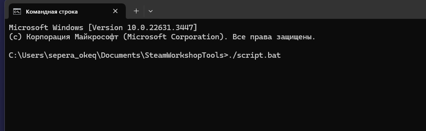
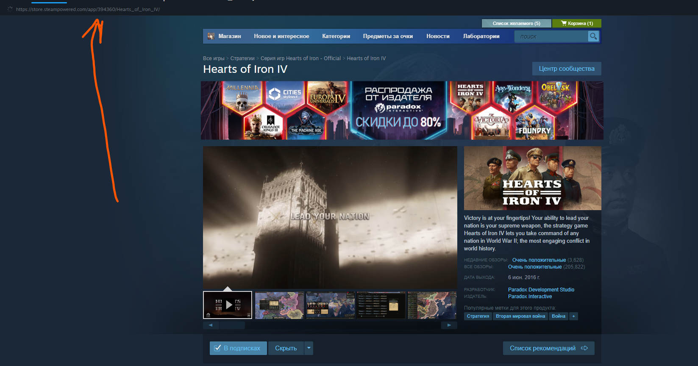
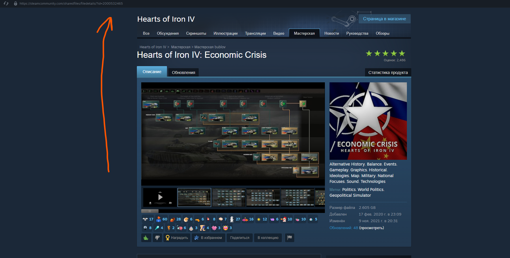

# SteamWorkshopTools

> Устарело, но работает:
Manual/В ручную - [here/тык](https://github.com/Sepera-okeq/SteamWorkshopTools/tree/main/manual)

This script is based on the use of SteamCMD. Read more [here](https://developer.valvesoftware.com/wiki/SteamCMD)

Русская версия доступна здесь: [тык](https://github.com/Sepera-okeq/SteamWorkshopTools/blob/main/README-RU.md)

Choose your own OS:

- [SteamWorkshopTools](#steamworkshoptools)
  - [Windows](#windows)
  - [Linux](#linux)
  - [MasOS](#masos)
  - [SteamID](#steamid)
    - [How do I find the AppID?](#how-do-i-find-the-appid)
    - [How do I find my ID for my mod?](#how-do-i-find-my-id-for-my-mod)

## Windows

0. Установите Powershell 7, следуя инструкциям [MSDN](https://learn.microsoft.com/ru-ru/powershell/scripting/install/installing-powershell-on-windows?view=powershell-7.4)
Рекомендуется: [MS Store](https://apps.microsoft.com/detail/9mz1snwt0n5d?rtc=1&hl=nl-nl&gl=NL)

1. Склонируйте проект:

```bash
git clone https://github.com/Sepera-okeq/SteamWorkshopTools.git
```

2. Перейдите в папку репозитория:

```bash
cd SteamWorkshopTools
```

**Или**

Нажмите по пустому месту в папке репозитория с Shift+ПКМ и выберите в контекстном меню "Открыть тут Терминал" / "Открыть тут Powershell"


4. Запустите скрипт


## Linux

Not implemented. Use the manual method.

## MasOS

Not implemented. Use the manual method.

## SteamID

### How do I find the AppID?

Open game profile in Steam and copy the values from the link



### How do I find my ID for my mod?

Open mod profile in Steam and copy the values from the link


